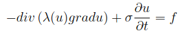

# Лабораторные работы по дисциплине "Уравнения математической физики" #
## Описание заданий для лабораторных работ ##

**1**. Решение эллиптических краевых задач методом конечных разностей.
>Вариант: область имеет L-образную форму. Предусмотреть учет первых и третьих краевых. Также реализовано построение любой прямоугольной области и решение эллиптической задачи в ней.

**2**. Решение нелинейных начально-краевых задач методами простой итерации и Ньютона.
> Вариант:
>
>

**3**. Решение гармонических задач.
> Вариант: решить трехмерную гармоническую задачу в декартовых координатах, базисные функции - трилинейные.

**4**. Решение несимметричных СЛАУ.
> Вариант: реализовать решение СЛАУ методом ``BCGSTAB`` с LU - предобуславливанием (алгоритм реализован в предыдущей лабораторной работе и находится в ``Solvers.cs``).